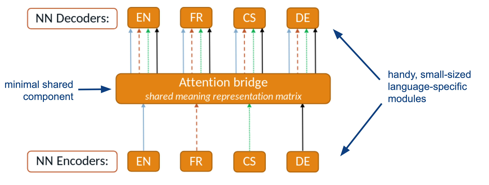
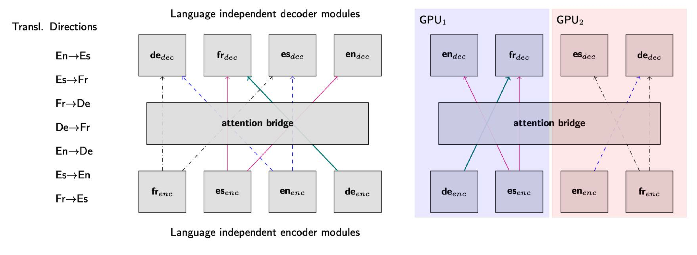
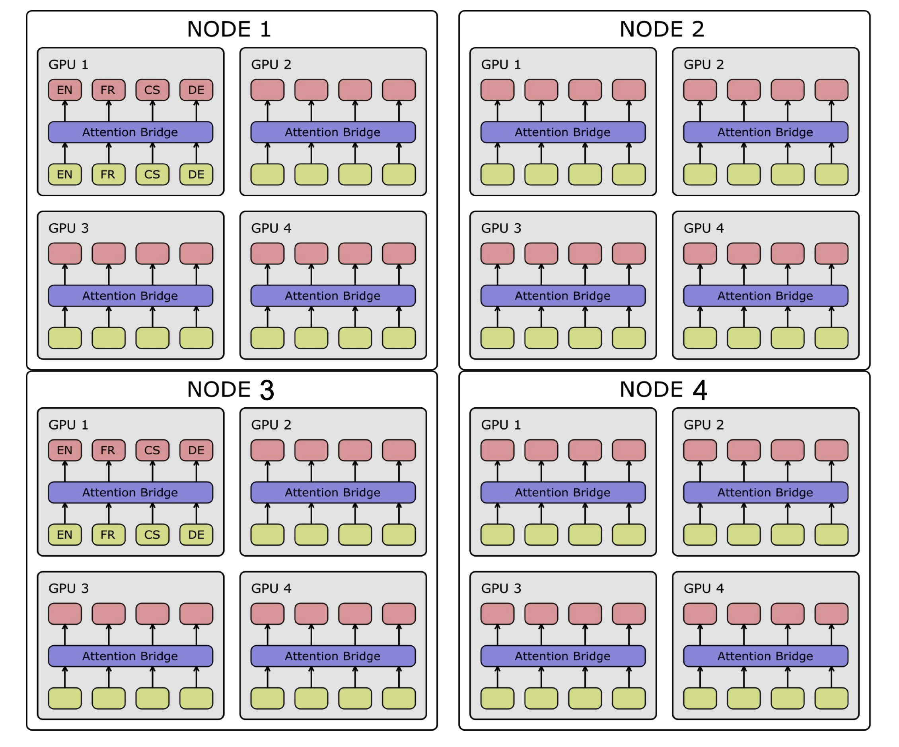
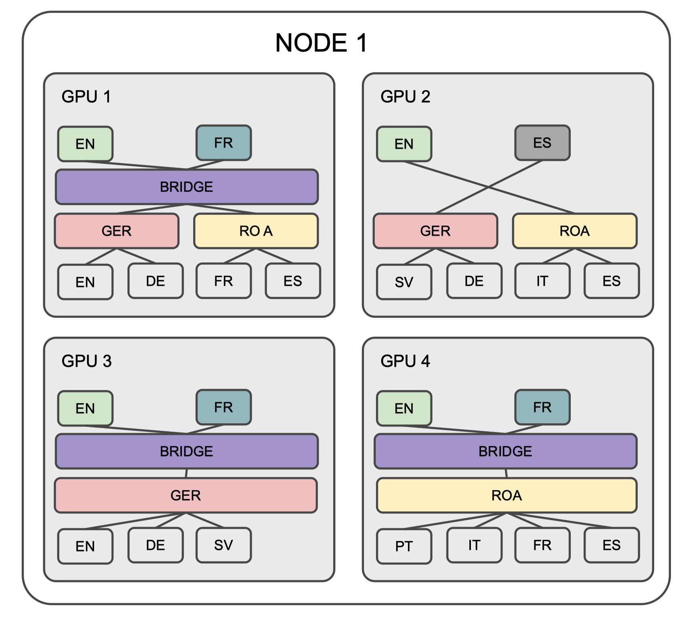
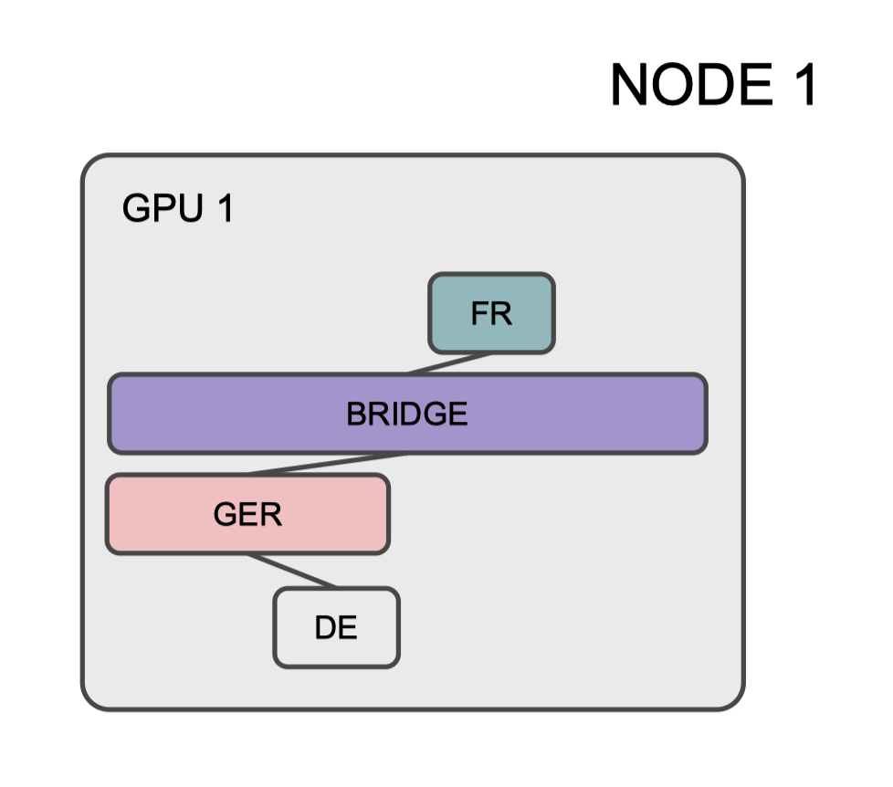

# Component-level Modularity

Building a scalable modular Neural Machine Translation (mNMT) system involves considering various features to ensure flexibility, efficiency, and ease of expansion.

It implements efficient GPU allocation strategies to make the most of available hardware resources. This involves optimizing the distribution of model components across GPUs, minimizing data transfer between GPUs, and leveraging parallel processing capabilities for training.

MAMMOTH offers component-level modularity for machine translation and flexibility in designing different sharing schemes for its modules.
The toolkit focuses on architectures where modular components can be
defined a priori and operate as separable units to enable flexible modular configuration.
Each task definition must explicitly state the sequence of modules to be used for the encoders and decoders (or "sharing groups").

## Anatomy of Parameter Sharing

The trichotomy of parameter sharing is (1) full sharing, (2) no sharing, and (3) partial sharing (or everything in between).
Partial sharing includes:
- Transversal, e.g., [Purason & Tättar (2022)](https://aclanthology.org/2022.eamt-1.12/)
- Longitudinal, e.g., [Lin et al. (2021)](https://aclanthology.org/2021.acl-long.25/)
- Embeddings or vocab hacks, .e.g., [Johnson et al. (2017)](https://aclanthology.org/Q17-1024/), [Lakew et al. (2018)](https://aclanthology.org/2018.iwslt-1.8/), and [Chronopoulou et al. (2020)](https://aclanthology.org/2020.emnlp-main.214/)

The training process is organized into a series of smaller "tasks," each of which is characterized by distinct attributes to enhance modularity and efficiency.
We break down mNMT training into a series of smaller "tasks"
- A task requires specific modules (encoder and decoder layers)
- A task is done on a specific device or across multiple devices
- A task corresponds to a specific (parallel) corpus

In short, a task corresponds to a specific model behavior.
In translation settings, a task will therefore correspond to a specific translation direction (say translating from Swahili to Catalan):
All training datapoints for this task  (i) must involve the same modules (pertaining to Swahili encoding and Catalan decoding); (ii) must be preprocessed with the same tokenizers; and (iii) can be grouped into a single bitext.
A centralized manager handles tasks synchronization.
This manager oversees the parallel execution of tasks, coordinating the flow of information between different modules, devices, and corpora to ensure a cohesive and synchronized training process.

### Flexible Modularity

Let's break down the key aspects of modularity by design:

1. **Layerwise Parameter Sharing Schemes**:
    - **Fully Shared Encoder and Fully Shared Decoder**: Both the encoder and decoder have shared parameters, meaning they are common across all languages or translation pairs.
    - **Partially Shared Encoder / Decoder**: Within each encoder or decoder, individual layers can be selectively shared or made language-specific. For example, the bottom encoder layers can be shared across languages while the top layers are language-specific, or the encoder can be fully shared while each target language gets its own decoder. Same applies to the decoders.

2. **Groupwise Sharing Schemes**:
    MAMMOTH supports grouping languages into clusters, where languages in the same cluster share parameters. Clusters are computed using hierarchical clustering (`AgglomerativeClustering` from scikit-learn) on a user-provided **distance matrix**. You can define the distance matrix using any criterion:
    - **Phylogenetic**: Distance based on language family trees (languages sharing a common ancestry are closer).
    - **Typological**: Distance based on linguistic features from typological databases (e.g., word order, morphology).
    - **Language Embeddings**: Distance based on language representations in a shared vector space.

    See the [config_config documentation](config_config.md) for how to provide the distance matrix.

<!-- ## Bridges and Structures for Sharing

Structures for the shared parameters consider key approaches such as fully-shared layers and attention bridges.

- Fully-shared layers
  - Transformer layers
  - [Attention bridges](attention_bridges.md), shared across all tasks as the visual representation as below

By combining these structures, MAMMOTH achieves broad parameter sharing across languages and tasks. -->

## Custom Model Parallelism

MAMMOTH enables scaling-up a mNMT to a (very) large number of languages.
It deals with the task2gpu allocation problem as illustrated below.

It allows for custom model parallelism across nodes and GPUs to ensure optimal utilization of resources.
Modules allocated in more than 1 GPU have to be synced at all times.
The figure below illustrates the distribution of modules across multiple nodes:

Custom model parallelism increases parameter sharing versatility, allowing for synchronization of modules in GPUs based on specific criteria. For example:
- AB layer synced in GPUs 1,3&4
- Language-specific components synced as needed (e.g., EN-decoder in all GPUs)
- Language group-specific components also synced as needed (e.g., GER in GPUs 1,2&3)

Custom model parallelism increases inference efficiency:
- All modules are saved independently, allowing for streamlined loading during inference.
- Lightweight inference is achieved by loading only the modules relevant to the translation task at hand (e.g., DE->FR).

At training time, encoder-decoder communication is based on layer stacks.
Gradients are broadcasted only for modules currently in use, optimizing communication and reducing computational overhead.

In conclusion, the custom model parallelism in MAMMOTH is implemented to overcome the task-to-GPU allocation challenge, enhance parameter sharing versatility, and optimize both training and inference efficiency.
