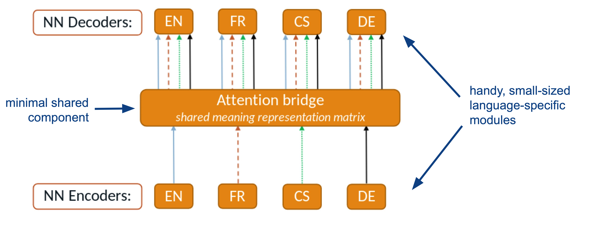
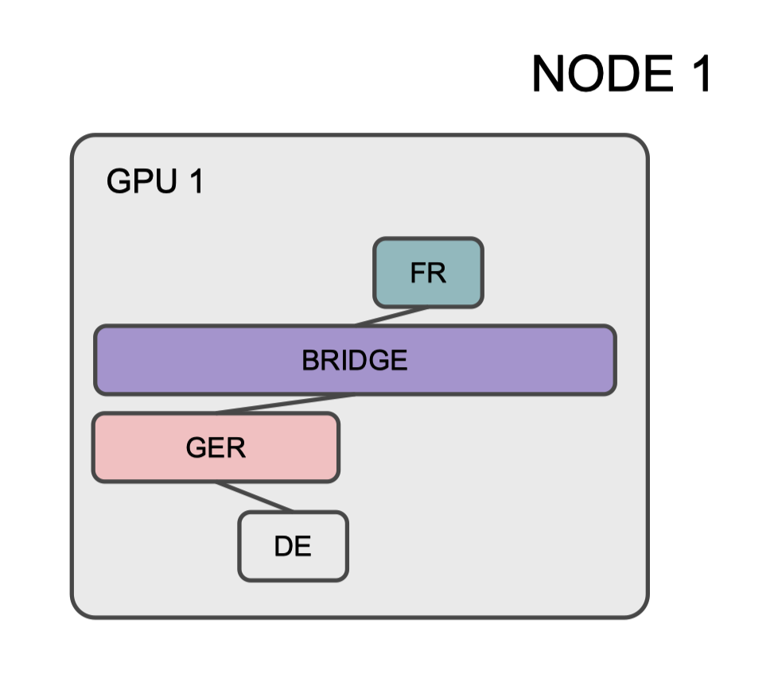

# Component-level Modularity

Building a scalable modular Neural Machine Translation (mNMT) system involves considering various features to ensure flexibility, efficiency, and ease of expansion.
MAMMOTH allows for flexible parameter sharing among modules. This includes sharing at different levels such as word embeddings, encoder states, or attention mechanisms. 
It implements efficient GPU allocation strategies to make the most of available hardware resources. This involves optimizing the distribution of model components across GPUs, minimizing data transfer between GPUs, and leveraging parallel processing capabilities for training and inference. 

MAMMOTH offers component-level modularity for machine translation and flexibility in designing different sharing schemes for its modules.
The toolkit focuses on architectures where modular components can be
defined a priori and operate as separable units to enable flexible modular configuration.
Each task definition must explicitly state the sequence of modules to be used for the encoders and decoders (or “sharing groups”).

## Anatomy of Parameter Sharing

The trichotomy of parameter sharing is (1) full sharing, (2) no sharing, and (3) partial sharing (or everything in between).
Partial sharing includes:
- Transversal, e.g., [Purason & Tättar (2022)](https://aclanthology.org/2022.eamt-1.12/)
- Longitudinal, e.g., [Lin et al. (2021)](https://aclanthology.org/2021.acl-long.25/)
- Embeddings or vocab hacks, .e.g., [Johnson et al. (2017)](https://aclanthology.org/Q17-1024/), [Lakew et al. (2018)](https://aclanthology.org/2018.iwslt-1.8/), and [Chronopoulou et al. (2020)](https://aclanthology.org/2020.emnlp-main.214/)

The training process is organized into a series of smaller "tasks," each of which is characterized by distinct attributes to enhance modularity and efficiency.
We break down mNMT training into a series of smaller “tasks”
- A task requires specific modules
- A task is done on a specific device
- A task corresponds to a specific (parallel) corpus

A centralized manager handles tasks synchronization.
This manager oversees the parallel execution of tasks, coordinating the flow of information between different modules, devices, and corpora to ensure a cohesive and synchronized training process.

### Flexible Modularity

Let's break down the key aspects of modularity by design:

1. **Depth of Encoder & Decoder**:
    - **Balanced**: The encoder and decoder have the same depths.
    - **Deep-enc-shallow-dec**: The encoder is deep, while the decoder is relatively shallow.

2. **Layerwise Parameter Sharing Schemes**:
    - **Fully Shared Encoder and Fully Shared Decoder**: Both the encoder and decoder have shared parameters, meaning they are common across all languages or translation pairs.
    - **Fully Shared Encoder and Target-Specific Decoder**: The encoder is shared, but each target language has its own decoder.
    - **Apple-Style Learning Language-specific Layers**: The encoder contains both source and target-specific layers.
    - **Adapter-Like Low-Rank Residual Layers**: To facilitate adaptation for different languages or translation tasks.

3. **Groupwise Sharing Schemes**:
    - **Phylogenetic**: Parameters could be shared among languages that are phylogenetically related, meaning they share a common ancestry.
    - **Clustering Based on Typological Database**: Sharing could be determined based on linguistic typological features or characteristics.
    - **Clustering Based on Language Embeddings**: This could involve sharing parameters based on the embeddings of languages in a common vector space.

4. **Subword Vocabularies**:
    - **Fully Shared**: a fully shared subword vocabulary for all languages 
    - **Language-Specific**: language-specific subword vocabularies for each separate language

## Bridges and Structures for Sharing

Structures for the shared parameters consider two key approaches: fully-shared layers and adapters.

- Fully-shared layers
  - Transformer layers
  - Feed-forward layers
  - [Attention bridges](attention_bridges.md), shared across all tasks as the visual representation as below

- [Adapters](https://aclanthology.org/D19-1165/) for finer-grained sharing by adapting specific components

By combining these structures, MAMMOTH achieves a balance between broad parameter sharing through fully-shared layers and targeted adaptability through adapters. 

## Custom Model Parallelism

MAMMOTH enables scaling-up a mNMT to a (very) large number of languages. 
It deals with the task2gpu allocation problem as illustrated below.

It allow for custom model parallelism across nodes and GPUs to ensure optimal utilization of resources.
Modules allocated in more than 1 GPU have to be synced at all times.
The figure below illustrates the distribution of modules across multiple nodes:

Custom model parallelism increases parameter sharing versatility, allowing for synchronization of modules in GPUs based on specific criteria. For example:
- AB layer synced in GPUs 1,3&4
- Language-specific components synced as needed (e.g., EN-decoder in all GPUs)
- Language group-specific components also synced as needed (e.g., GER in GPUs 1,2&3)

Custom model parallelism increases inference efficiency:
- All modules are saved independently, allowing for streamlined loading during inference.
- Lightweight inference is achieved by loading only the modules relevant to the translation task at hand (e.g., DE->FR).

At training time, [^1]coder communication is based on layer stacks (and adapters).
Gradients are broadcasted only for modules currently in use, optimizing communication and reducing computational overhead.

In conclusion, the custom model parallelism in MAMMOTH is implemented to overcome the task-to-GPU allocation challenge, enhance parameter sharing versatility, and optimize both training and inference efficiency. 

[^1]: Thanks to CSC infrastructure